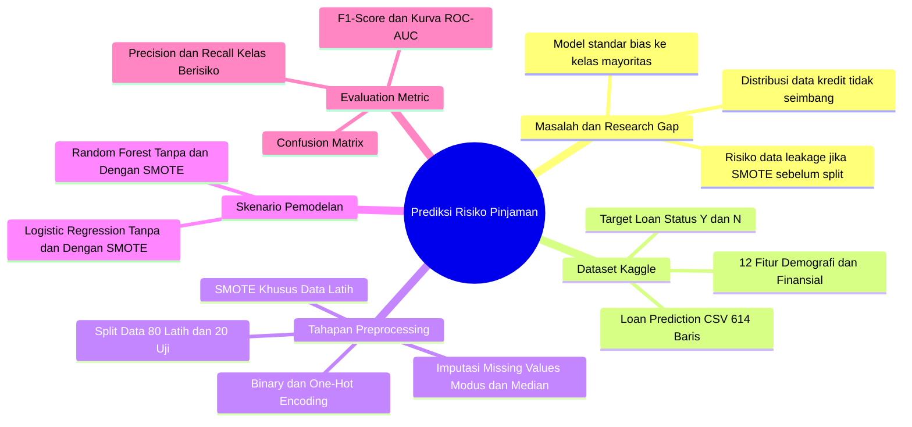

# Research Mind Map

```mermaid
mindmap
  root((Prediksi Risiko Pinjaman))
    Masalah dan Research Gap
      Distribusi data kredit tidak seimbang
      Model standar bias ke kelas mayoritas
      Risiko data leakage jika SMOTE sebelum split
    Dataset Kaggle
      Loan Prediction CSV 614 Baris
      12 Fitur Demografi dan Finansial
      Target Loan Status Y dan N
    Tahapan Preprocessing
      Imputasi Missing Values Modus dan Median
      Binary dan One-Hot Encoding
      Split Data 80 Latih dan 20 Uji
      SMOTE Khusus Data Latih
    Skenario Pemodelan
      Logistic Regression Tanpa dan Dengan SMOTE
      Random Forest Tanpa dan Dengan SMOTE
    Evaluation Metric
      Confusion Matrix
      Precision dan Recall Kelas Berisiko
      F1-Score dan Kurva ROC-AUC
```
